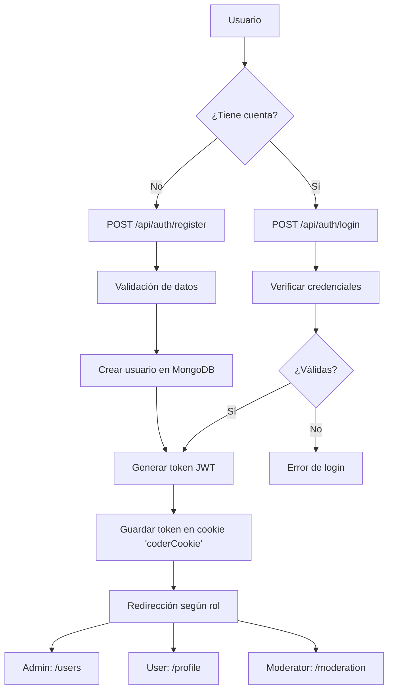
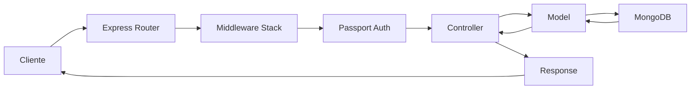

# 🚀 Coder-77155 - Sistema de Autenticación Completo

<div align="center">


**Sistema completo de autenticación con Node.js, Express, MongoDB y Passport.js**

[📋 Características](#-características) • [🚀 Instalación](#-instalación) • [🔐 Autenticación](#-autenticación) • [📚 API](#-api) • [🏗️ Arquitectura](#️-arquitectura) • [🐳 Docker](#-docker)

</div>

---

## 📋 Características

### 🔐 **Sistema de Autenticación Completo**
- ✅ **Registro y Login** con email y contraseña
- ✅ **Autenticación JWT** con tokens seguros en cookies
- ✅ **Autenticación OAuth** con GitHub
- ✅ **Control de acceso** basado en roles (user, admin, moderator)
- ✅ **Tokens JWT** almacenados en cookies httpOnly
- ✅ **Manejo robusto de errores** con vistas personalizadas

### 🎨 **Interfaz de Usuario**
- ✅ **Vistas Handlebars** responsivas y modernas
- ✅ **Diseño profesional** con Bootstrap 5.3
- ✅ **Animaciones suaves** y efectos visuales
- ✅ **Vista de administración** para gestión de usuarios
- ✅ **Panel de moderación** para roles especiales
- ✅ **Manejo de errores** con páginas personalizadas

### 🛡️ **Seguridad y Validación**
- ✅ **Validación robusta** con Mongoose schemas
- ✅ **Hashing de contraseñas** con bcrypt
- ✅ **Autenticación JWT** con Passport.js
- ✅ **Middleware de autenticación** personalizado
- ✅ **Protección de rutas** por roles con JWT
- ✅ **Sanitización de datos** de entrada
- ✅ **Tokens seguros** con expiración de 24 horas

### 🏗️ **Arquitectura Moderna**
- ✅ **ES Modules** (import/export)
- ✅ **Arquitectura MVC** bien estructurada
- ✅ **Autenticación JWT** con Passport
- ✅ **Middleware modular** y reutilizable
- ✅ **Configuración centralizada**
- ✅ **Logging estructurado**
- ✅ **Manejo de errores centralizado**

---

## 🚀 Instalación

### Prerrequisitos

- [Node.js](https://nodejs.org/) (versión 22 o superior)
- [npm](https://www.npmjs.com/) o [yarn](https://yarnpkg.com/)
- [MongoDB](https://www.mongodb.com/) (local o Atlas)
- [GitHub OAuth App](https://github.com/settings/applications/new) (opcional)

### Instalación Local

1. **Clona el repositorio**
   ```bash
   git clone git@github.com:jorgecardenas9006/coder-77155.git
   cd coder-77155
   ```

2. **Instala las dependencias**
   ```bash
   npm install
   ```

3. **Configura las variables de entorno**
   ```bash
   cp .env.example .env
   ```
   
   Edita el archivo `.env` con tus configuraciones:
   ```env
   # Servidor
   PORT=3000
   
   # Base de datos
   MONGODB_URI=mongodb://localhost:27017/coder-77155
   
   # Seguridad
   SECRET=tu-clave-secreta-super-segura
   
   # GitHub OAuth (opcional)
   GITHUB_CLIENT_ID=tu_client_id_de_github
   GITHUB_CLIENT_SECRET=tu_client_secret_de_github
   ```

4. **Inicia MongoDB** (si usas instalación local)
   ```bash
   # macOS con Homebrew
   brew services start mongodb-community
   
   # Ubuntu/Debian
   sudo systemctl start mongod
   
   # Windows
   net start MongoDB
   ```

5. **Ejecuta la aplicación**
   ```bash
   # Modo desarrollo (con hot reload)
   npm run dev
   
   # Modo producción
   npm start
   ```

6. **Accede a la aplicación**
   - **Frontend**: http://localhost:3000
   - **API**: http://localhost:3000/api

---

## 🔐 Autenticación

### Métodos de Autenticación Disponibles

#### 1. **Registro Tradicional**
- Email y contraseña
- Validación completa de datos
- Hash seguro de contraseñas con bcrypt
- Verificación de email único
- **Genera token JWT** en cookie `coderCookie`

#### 2. **Login Tradicional**
- Autenticación con email/contraseña
- **Genera token JWT** con datos del usuario
- Token almacenado en cookie httpOnly (`coderCookie`)
- Expiración de 24 horas
- Redirección automática según rol

#### 3. **Autenticación OAuth con GitHub**
- Login con cuenta de GitHub
- Obtención automática de datos de perfil
- Vinculación con cuentas existentes
- **Genera token JWT** al autenticarse
- Manejo de errores específicos

#### 4. **Autenticación JWT**
- **Token JWT** almacenado en cookie httpOnly
- Todos los datos del usuario en el token
- Validación automática con `passportCall('jwt')`
- Sin necesidad de sesiones en base de datos
- Stateless authentication

### Flujo de Autenticación JWT



### Roles y Permisos

| Rol | Permisos | Acceso |
|-----|----------|--------|
| **user** | Básico | `/profile` |
| **moderator** | Moderación | `/profile`, `/moderation` |
| **admin** | Completo | `/profile`, `/moderation`, `/users` |

---

## 📚 API

### Endpoints de Autenticación

#### 🔐 **Autenticación**

| Método | Endpoint | Descripción | Autenticación |
|--------|----------|-------------|---------------|
| `POST` | `/api/auth/register` | Registrar nuevo usuario | ❌ |
| `POST` | `/api/auth/login` | Iniciar sesión (genera JWT) | ❌ |
| `GET` | `/api/auth/profile` | Obtener perfil actual | ✅ JWT |
| `GET` | `/api/auth/current` | Obtener usuario actual | ✅ JWT |
| `POST` | `/api/auth/logout` | Cerrar sesión | ❌ |
| `GET` | `/api/auth/github` | Iniciar OAuth GitHub | ❌ |
| `GET` | `/api/auth/githubcallback` | Callback OAuth GitHub | ❌ |

#### 👥 **Usuarios**

| Método | Endpoint | Descripción | Autenticación | Rol |
|--------|----------|-------------|---------------|-----|
| `GET` | `/api/users` | Obtener todos los usuarios | ✅ JWT | admin |
| `DELETE` | `/api/users/:id` | Eliminar usuario | ✅ JWT | admin |

### Ejemplos de Uso

#### 🔐 **Registro de Usuario**
```bash
curl -X POST http://localhost:3000/api/auth/register \
  -H "Content-Type: application/json" \
  -d '{
    "firstName": "Juan",
    "lastName": "Pérez",
    "email": "juan.perez@example.com",
    "password": "miPassword123",
    "phone": "+5491123456789",
    "role": "user",
    "dateOfBirth": "1990-05-15",
    "address": "Av. Corrientes 1234",
    "city": "Buenos Aires"
  }'
```

#### 🔐 **Login de Usuario**
```bash
curl -X POST http://localhost:3000/api/auth/login \
  -H "Content-Type: application/json" \
  -d '{
    "email": "juan.perez@example.com",
    "password": "miPassword123"
  }'

# Respuesta:
{
  "status": "success",
  "message": "Login exitoso",
  "token": "eyJhbGciOiJIUzI1NiIsInR5cCI6IkpXVCJ9...",
  "user": {
    "id": "...",
    "email": "juan.perez@example.com",
    "firstName": "Juan",
    "lastName": "Pérez",
    "role": "user"
  }
}
```

#### 👥 **Obtener Usuarios (Admin)**
```bash
curl -X GET http://localhost:3000/api/users \
  -H "Cookie: coderCookie=tu_jwt_token"
```

#### 🔐 **Obtener Perfil Actual**
```bash
curl -X GET http://localhost:3000/api/auth/profile \
  -H "Cookie: coderCookie=tu_jwt_token"
```

### Respuestas de la API

#### ✅ **Éxito**
```json
{
  "status": "success",
  "message": "Usuario registrado correctamente"
}
```

#### ❌ **Error**
```json
{
  "status": "error",
  "message": "El email ya está en uso",
  "code": "EMAIL_EXISTS"
}
```

### Cómo Funciona la Autenticación JWT

1. **Login**: El usuario inicia sesión con email y contraseña
2. **Generación de Token**: Se crea un token JWT con los datos del usuario
3. **Almacenamiento**: El token se guarda en una cookie httpOnly llamada `coderCookie`
4. **Validación**: Cada request protegida valida el token automáticamente
5. **Acceso**: El middleware `passportCall('jwt')` decodifica el token y expone `req.user`

**Estructura del Token JWT:**
```json
{
  "id": "user_id",
  "email": "user@example.com",
  "role": "user|admin|moderator",
  "firstName": "Nombre",
  "lastName": "Apellido",
  "phone": "+1234567890",
  "avatar": "url",
  "dateOfBirth": "1990-01-01",
  "address": "Dirección",
  "city": "Ciudad",
  "isActive": true,
  "isEmailVerified": false,
  "preferences": {
    "language": "es",
    "timezone": "America/Argentina/Buenos_Aires",
    "notifications": { "email": true, "push": true, "sms": false }
  },
  "iat": 1234567890,
  "exp": 1234657890
}
```

---

## 🏗️ Arquitectura

### Estructura del Proyecto

```
src/
├── app.js                      # Punto de entrada principal
├── config/                     # Configuración centralizada
│   ├── index.js               # Exportaciones centralizadas
│   ├── env.js                 # Variables de entorno
│   ├── db.js                  # Conexión a MongoDB
│   └── passport.config.js     # Configuración de Passport
├── models/                    # Modelos de datos
│   └── user.model.js         # Modelo de Usuario
├── routes/                    # Rutas de la aplicación
│   ├── auth.router.js         # Rutas de autenticación
│   ├── users.router.js        # Rutas de usuarios
│   └── views.router.js        # Rutas de vistas
├── middlewares/               # Middlewares personalizados
│   ├── index.js              # Exportaciones centralizadas
│   ├── auth.middleware.js    # Middlewares de autenticación
│   ├── validation.middleware.js # Middlewares de validación
│   ├── error.middleware.js   # Middlewares de errores
│   └── oauth.middleware.js   # Middlewares de OAuth
├── utils/                     # Utilidades
│   ├── index.js              # Utilidades generales
│   └── pass.js               # Utilidades de contraseñas
└── views/                    # Vistas Handlebars
    ├── layouts/              # Layouts principales
    │   ├── login.handlebars  # Vista de login
    │   ├── register.handlebars # Vista de registro
    │   ├── profile.handlebars # Vista de perfil
    │   ├── users.handlebars  # Vista de usuarios (admin)
    │   ├── moderation.handlebars # Vista de moderación
    │   ├── oauth-error.handlebars # Vista de error OAuth
    │   └── role-error.handlebars # Vista de error de roles
    └── home.handlebars       # Vista de inicio
```

### Componentes Principales

#### **🔧 Configuración (`config/`)**
- **`env.js`**: Variables de entorno con valores por defecto
- **`db.js`**: Conexión a MongoDB con manejo de errores
- **`passport.config.js`**: Estrategias de autenticación (JWT + Local + GitHub)
- **`index.js`**: Exportaciones centralizadas

#### **🛡️ Middlewares (`middlewares/`)**
- **`auth.middleware.js`**: Autenticación y autorización por roles con JWT
- **`validation.middleware.js`**: Validación de datos de entrada
- **`error.middleware.js`**: Manejo centralizado de errores
- **`oauth.middleware.js`**: Manejo específico de errores OAuth
- **`passportCall`**: Middleware helper para JWT authentication

#### **🎨 Vistas (`views/`)**
- **Diseño responsivo** con Bootstrap 5.3
- **Animaciones suaves** y efectos visuales
- **Control de acceso** por roles con JWT
- **Datos de usuario** desde token JWT

### Flujo de Datos



---

## 🐳 Docker

### Despliegue con Docker Compose (Recomendado)

1. **Clona y navega al proyecto**
   ```bash
   git clone git@github.com:jorgecardenas9006/coder-77155.git
   cd coder-77155
   ```

2. **Configura las variables de entorno**
   ```bash
   cp .env.example .env
   ```
   
   Configura las variables en `.env`:
   ```env
   PORT=3000
   MONGODB_URI=mongodb://mongodb:27017/coder-77155
   SECRET=tu-clave-secreta-super-segura
   GITHUB_CLIENT_ID=tu_client_id
   GITHUB_CLIENT_SECRET=tu_client_secret
   ```

3. **Ejecuta con Docker Compose**
   ```bash
   # Construir y ejecutar todos los servicios
   docker-compose up --build
   
   # Ejecutar en segundo plano
   docker-compose up -d --build
   ```

4. **Verifica que todo funcione**
   ```bash
   # Ver logs de los servicios
   docker-compose logs -f
   
   # Verificar estado de los contenedores
   docker-compose ps
   ```

### Comandos Docker Útiles

```bash
# Detener todos los servicios
docker-compose down

# Detener y eliminar volúmenes (⚠️ elimina datos de MongoDB)
docker-compose down -v

# Reconstruir solo la aplicación
docker-compose up --build app

# Ejecutar comandos dentro del contenedor
docker-compose exec app npm run dev

# Ver logs de un servicio específico
docker-compose logs -f app
docker-compose logs -f mongodb
```

---

## 🔧 Configuración Avanzada

### Variables de Entorno Completas

```env
# Servidor
PORT=3000

# Base de datos
MONGODB_URI=mongodb://localhost:27017/coder-77155

# Seguridad
SECRET=tu-clave-secreta-super-segura-minimo-32-caracteres

# GitHub OAuth
GITHUB_CLIENT_ID=tu_client_id_de_github
GITHUB_CLIENT_SECRET=tu_client_secret_de_github

# Para Docker Compose
# MONGODB_URI=mongodb://mongodb:27017/coder-77155
```

### Configuración de GitHub OAuth

1. **Ve a GitHub Settings > Developer settings > OAuth Apps**
2. **Crea una nueva OAuth App** con:
   - **Application name**: Tu aplicación
   - **Homepage URL**: http://localhost:3000
   - **Authorization callback URL**: http://localhost:3000/api/auth/githubcallback
3. **Copia el Client ID y Client Secret** a tu archivo `.env`

### Scripts Disponibles

```bash
npm run dev      # Ejecuta con Nodemon (desarrollo)
npm start        # Ejecuta en modo producción
npm test         # Ejecuta tests (próximamente)
npm run build    # Construye para producción (próximamente)
```

---

## 🛡️ Seguridad

### Medidas de Seguridad Implementadas

- ✅ **Hashing de contraseñas** con bcrypt
- ✅ **Autenticación JWT** con tokens seguros
- ✅ **Cookies httpOnly** para tokens
- ✅ **Validación de entrada** con Mongoose
- ✅ **Sanitización de datos** automática
- ✅ **Control de acceso** basado en roles con JWT
- ✅ **Manejo seguro de errores** sin exposición de datos
- ✅ **Variables de entorno** para datos sensibles
- ✅ **Middleware de autenticación** robusto
- ✅ **Expiración de tokens** (24 horas)
- ✅ **Stateless authentication** sin sesiones en BD

### Mejores Prácticas

- 🔒 **Nunca** expongas contraseñas en respuestas
- 🔒 **Usa HTTPS** en producción
- 🔒 **Valida** todos los datos de entrada
- 🔒 **Implementa** rate limiting (próximamente)
- 🔒 **Usa** claves secretas fuertes
- 🔒 **Mantén** las dependencias actualizadas

---

## 🚀 Despliegue en Producción

### Preparación para Producción

1. **Configura variables de entorno de producción**
   ```env
   PORT=3000
   MONGODB_URI=mongodb://tu-servidor-mongodb:27017/coder-77155-prod
   SECRET=clave-super-secreta-de-produccion-minimo-64-caracteres
   NODE_ENV=production
   ```

2. **Optimiza la aplicación**
   ```bash
   # Instala solo dependencias de producción
   npm ci --only=production
   
   # Construye la aplicación
   npm run build
   ```

3. **Configura el servidor web** (Nginx recomendado)
   ```nginx
   server {
       listen 80;
       server_name tu-dominio.com;
       
       location / {
           proxy_pass http://localhost:3000;
           proxy_http_version 1.1;
           proxy_set_header Upgrade $http_upgrade;
           proxy_set_header Connection 'upgrade';
           proxy_set_header Host $host;
           proxy_cache_bypass $http_upgrade;
       }
   }
   ```

### Con Docker en Producción

```bash
# Usar docker-compose.prod.yml
docker-compose -f docker-compose.prod.yml up -d
```

---

## 🧪 Testing

### Próximas Implementaciones

- [ ] **Tests unitarios** con Jest
- [ ] **Tests de integración** con Supertest
- [ ] **Tests de autenticación** OAuth
- [ ] **Tests de middleware** de autorización
- [ ] **Tests de validación** de datos
- [ ] **Coverage reports** con Istanbul

### Estructura de Tests Propuesta

```
tests/
├── unit/                    # Tests unitarios
│   ├── models/             # Tests de modelos
│   ├── middlewares/        # Tests de middlewares
│   └── utils/              # Tests de utilidades
├── integration/            # Tests de integración
│   ├── auth/               # Tests de autenticación
│   ├── users/              # Tests de usuarios
│   └── oauth/              # Tests de OAuth
└── e2e/                    # Tests end-to-end
    └── workflows/          # Flujos completos
```

---

## 📈 Monitoreo y Logging

### Logging Implementado

- ✅ **Request logging** con middleware personalizado
- ✅ **Error logging** centralizado
- ✅ **OAuth error logging** detallado
- ✅ **Console logging** estructurado

### Próximas Mejoras

- [ ] **Winston** para logging avanzado
- [ ] **Morgan** para HTTP request logging
- [ ] **Health checks** endpoints
- [ ] **Metrics** con Prometheus
- [ ] **Alerting** con sistemas de monitoreo

---

## 🔄 Roadmap

### ✅ **Completado**
- Sistema de autenticación JWT completo
- OAuth con GitHub
- Vistas responsivas con Handlebars
- Control de acceso por roles con JWT
- Manejo robusto de errores
- Tokens JWT en cookies httpOnly
- Dockerización completa
- Autenticación stateless

### 🚧 **En Progreso**
- Documentación completa
- Optimización de performance

### 📋 **Próximas Características**
- [ ] **Rate limiting** para prevenir abuso
- [ ] **Tests automatizados** completos
- [ ] **CI/CD pipeline** con GitHub Actions
- [ ] **Swagger/OpenAPI** documentation
- [ ] **Paginación** en endpoints
- [ ] **Filtros y búsqueda** avanzada
- [ ] **Notificaciones** por email
- [ ] **Dashboard** de administración
- [ ] **Audit logs** para seguridad
- [ ] **Refresh tokens** para mayor seguridad
- [ ] **Revocación de tokens**

---

## 🤝 Contribución

### Cómo Contribuir

1. **Fork** el repositorio
2. **Crea** una rama para tu feature (`git checkout -b feature/nueva-caracteristica`)
3. **Commit** tus cambios (`git commit -m 'Agregar nueva característica'`)
4. **Push** a la rama (`git push origin feature/nueva-caracteristica`)
5. **Abre** un Pull Request

### Estándares de Código

- ✅ **ESLint** para linting
- ✅ **Prettier** para formateo
- ✅ **Conventional Commits** para mensajes
- ✅ **JSDoc** para documentación
- ✅ **Tests** para nuevas características

---

## 📝 Licencia

Este proyecto está bajo la Licencia ISC.

---

## 👨‍💻 Autor

**Jorge Cárdenas** - Desarrollado como parte del curso Backend II de Coder House.

- 📧 **Email**: jorgecardenas9006@gmail.com
- 🐙 **GitHub**: [@jorgecardenas9006](https://github.com/jorgecardenas9006)
- 💼 **LinkedIn**: [Jorge Cárdenas](https://linkedin.com/in/jorgecardenas9006)

---

<div align="center">

**¿Te gusta este proyecto? ¡Dale una ⭐!**

[🐛 Reportar Bug](https://github.com/jorgecardenas9006/coder-77155/issues) • [💡 Solicitar Feature](https://github.com/jorgecardenas9006/coder-77155/issues) • [📖 Documentación](https://github.com/jorgecardenas9006/coder-77155/wiki)

---

**Construido con ❤️ usando Node.js, Express, MongoDB y Passport.js**

</div>